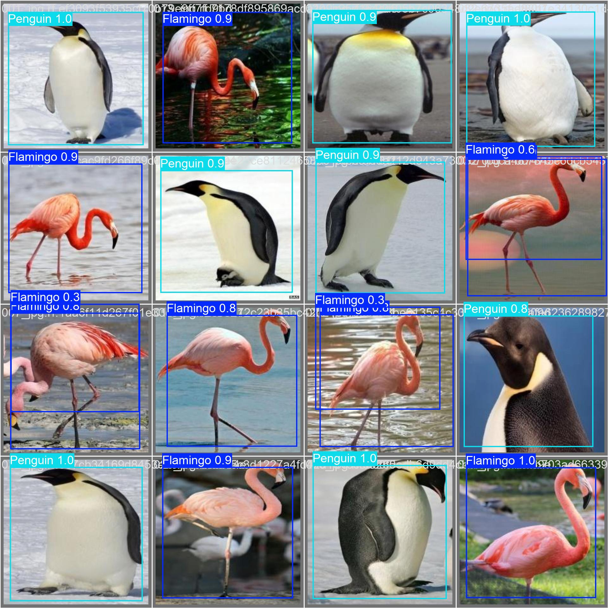
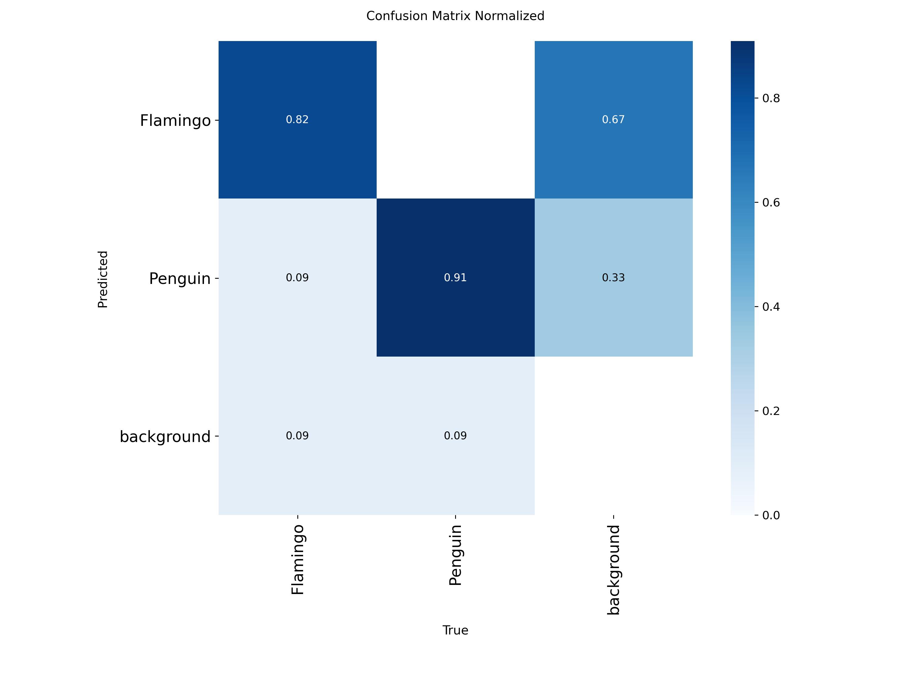

<div align="center">

# 🦩🐧 Detector de Flamencos y Pingüinos
### *Pipeline de Clasificación YOLOv11 — Entrenamiento + Aplicación Web Interactiva*


> Proyecto integral de **visión artificial** que entrena diversas variantes de YOLOv11 para detectar y diferenciar **Flamencos** 🦩 y **Pingüinos** 🐧, incluyendo una aplicación web profesional para inferencia en tiempo real.

</div>

---

## 📑 Tabla de Contenidos

1. [Vista General del Proyecto](#-vista-general-del-proyecto)
2. [Estructura del Proyecto](#-estructura-del-proyecto)
3. [Gestión y Clasificación de Datos](#-gestión-y-clasificación-de-datos)
4. [Lógica del Pipeline — `main.ipynb`](#-lógica-del-pipeline--mainipynb)
5. [Módulo de Aplicación — `app.py`](#-módulo-de-aplicación--apppy)
6. [Resultados y Métricas](#-resultados-y-métricas)
7. [Ejemplos de Detección](#-ejemplos-de-detección)
8. [Instalación y Uso](#-instalación-y-uso)

---

## 🔭 Vista General del Proyecto

Este proyecto implementa un pipeline de **transfer learning** utilizando la familia de modelos YOLOv11. El objetivo es construir un detector robusto capaz de identificar dos especies en diversos entornos:

| Clase | Etiqueta | Descripción |
|-------|-------|-------------|
| 0 | `Flamingo` | Ave zancuda rosada — hábitats tropicales |
| 1 | `Penguin` | Ave marina no voladora — regiones antárticas |

**Alcance funcional:**
- **Adquisición automatizada:** Descarga vía API de Kaggle o Google Drive.
- **Entrenamiento Multi-modelo:** Experimentación con 4 variantes de YOLOv11 (Nano, Small, Large).
- **Selección de Elite:** Exportación automática de los mejores pesos basados en mAP.
- **Interfaz de Usuario:** Aplicación Streamlit para análisis mediante cámara web o archivos.

---

## 🗂️ Estructura del Proyecto

```
Recognition-and-classification-YOLO-/
├── 📓 main.ipynb         ← Cerebro del proyecto (entrenamiento y métricas)
├── 🐍 app.py             ← Interfaz web interactiva (Streamlit)
├── 📄 requirements.txt   ← Dependencias del entorno
├── 🏋️ src/
│   ├── best.pt           ← Pesos entrenados finales (Mejor modelo)
│   └── yolo11n.pt        ← Modelo base para inferencia rápida
├── 📊 runs/
│   └── detect/           ← Resultados de cada entrenamiento (baselines)
├── 📦 datasets/          ← Imágenes y etiquetas organizadas
└── ⚖️ yolo11*.pt          ← Pesos pre-entrenados de Ultralytics
```

---

## 📂 Gestión y Clasificación de Datos

### Origen de los Datos
El dataset principal se obtiene de Kaggle (`giovanijazin/birds-penguins-and-flamingo`). Los datos están estructurados para cumplir con el estándar de YOLO, lo que permite una ingesta directa y eficiente.

### Estrategia de División (Split)
Para garantizar que el modelo aprenda correctamente y no se memorice los datos (overfitting), hemos dividido el dataset en tres conjuntos:

| Conjunto | Propósito | Carga de Datos |
|-----------|-----------|----------------|
| **Train** (Entrenamiento) | El "libro de texto" del modelo. Aquí se ajustan los pesos. | **~70%** |
| **Valid** (Validación) | El "examen parcial". Se usa durante el entrenamiento para medir el progreso y guardar el mejor modelo. | **~20%** |
| **Test** (Prueba) | El "examen final". Datos nunca antes vistos para evaluar el rendimiento real. | **~10%** |

### Lógica Detrás del Dataset
La clasificación se realiza mediante archivos de texto (`.txt`) donde cada línea representa un objeto detectado con coordenadas normalizadas. Esto permite que el modelo sea agnóstico a la resolución de la imagen original.

---

## 🧠 Lógica del Pipeline — `main.ipynb`

El notebook `main.ipynb` orquestra todo el proceso de ingeniería de visión:

1.  **Detección de Entorno:** Identifica si se ejecuta en local o en Colab para configurar las rutas automáticamente.
2.  **Gestor de Dependencias:** Descarga el dataset y configura las APIs de Kaggle.
3.  **Generación de `data.yaml`:** Crea el archivo de configuración dinámicamente, definiendo las rutas de los splits y los nombres de las clases.
4.  **Cicle de Entrenamiento:** Ejecuta múltiples baselines (Nano, Small, Large) para comparar rendimientos.
5.  **Comparador de Métricas:** Analiza los `results.csv` para determinar qué modelo tiene el mejor `mAP50-95`.

---

## 🖥️ Módulo de Aplicación — `app.py`

La aplicación web permite llevar el modelo a un entorno real:
- **Carga Eficiente:** Usa `@st.cache_resource` para cargar los pesos solo una vez, optimizando la memoria.
- **Procesamiento de Imagen:** Convierte formatos BGR (OpenCV) a RGB (Streamlit) y dibuja las cajas de detección con sus puntajes de confianza.
- **Interactividad:** Permite al usuario ajustar el "Umbral de Confianza" en tiempo real para filtrar detecciones dudosas.

---

## 📈 Resultados y Métricas

El modelo **YOLOv11-Small (`baseline_s`)** demostró ser el más equilibrado:

| Métrica | Valor | Interpretación |
|---------|-------|----------------|
| **mAP@50** | **0.908** | Capacidad sobresaliente de localización |
| **Precisión** | **98.9%** | Casi sin falsos positivos |
| **Recall** | **90.1%** | Detecta la gran mayoría de los animales presentes |

---

## 🖼️ Ejemplos de Detección

A continuación, ejemplos reales del proceso de validación:

### Inferencia en Lote de Validación
El modelo identifica con alta precisión tanto los flamencos como los pingüinos, incluso en grupos densos.



### Matriz de Confusión
Visualización que confirma que el modelo no confunde las clases entre sí.



---

## ⚙️ Instalación y Uso

1. **Clonar y Preparar:**
   ```bash
   pip install -r requirements.txt
   ```
2. **Entrenar (Opcional):** Ejecutar `main.ipynb` para generar nuevos pesos.
3. **Ejecutar Aplicación:**
   ```bash
   streamlit run app.py
   ```

---
<div align="center">

**Proyecto desarrollado con fines educativos en IABD**
*YOLOv11 · Ultralytics · Streamlit*
</div>
